# UFA Analytics

> A full-stack sports analytics platform for the [Ultimate Frisbee Association](https://theultimates.com/) — built to surface insights that don't exist anywhere else in the sport.

<div align="center">

**[🌐 ultimate-analytics.com](https://www.ultimate-analytics.com/)**

Built by [Joe Molder](https://github.com/JoeMolder)

</div>

---

## About

The UFA is a professional ultimate frisbee league with rich play-by-play data and no public analytics tooling. I built this at the intersection of a genuine interest in the sport and a goal of demonstrating full-stack ML engineering in a domain where the tooling doesn't yet exist. The result is a production-deployed platform covering 762 games and ~560,000 events across six seasons (2021–2026), combining a custom data pipeline, relational database, REST API, and a suite of machine learning models built from scratch.

---

## Game Explorer & Play Walk-through

Browse any game in the dataset, filter by team, and step through every throw in a point using the keyboard — the indicator bar shows the team with possession, thrower, receiver, and event type in real time.

<div align="center">
  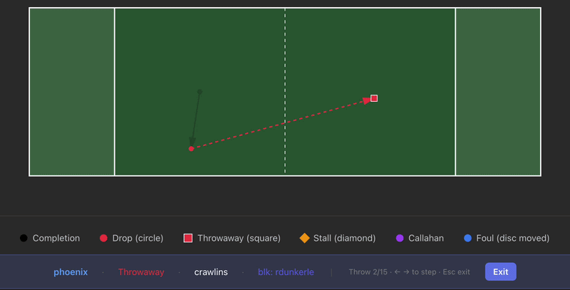
</div>

---

## Player Analytics

Every player has a full season-by-season stat table — including completions, assists, goals, blocks, drops, turnovers, and +/- — with an expandable per-game log on each row. Throw tendencies and block type distributions are visualized alongside.

<div align="center">
  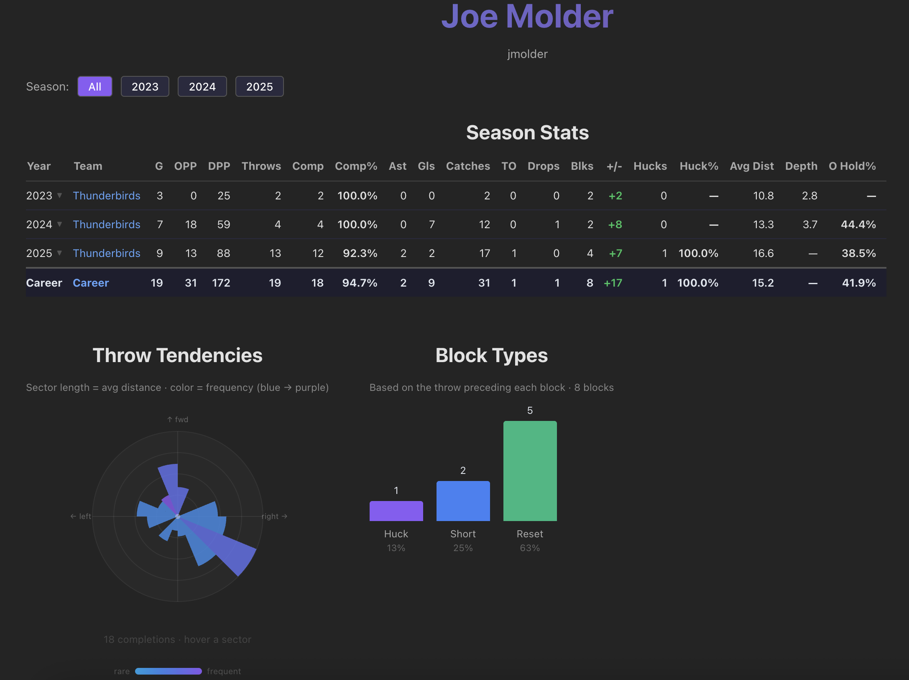
</div>
<div align="center">
  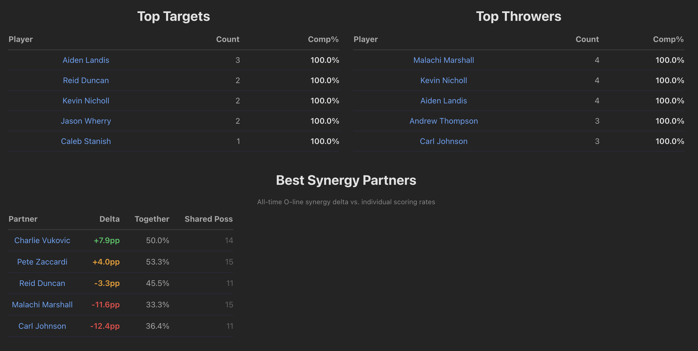
</div>

---

## Throw Prediction Heatmap

A conditional normalizing flow model predicts the probability distribution of where a throw will land, conditioned on thrower position and player identity. Drag across the field to update the heatmap in real time.

<div align="center">
  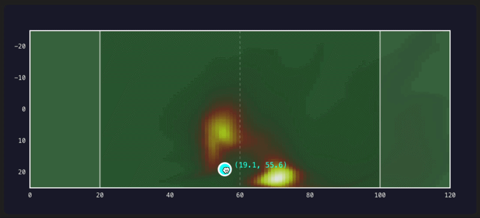
</div>

---

## Expected Possession Value (EPV)

A neural network estimates the probability that a team scores from any field position at any point in a possession. Filter by team or game context to compare offensive efficiency across the league.

<div align="center">
  <table>
    <tr>
      <td>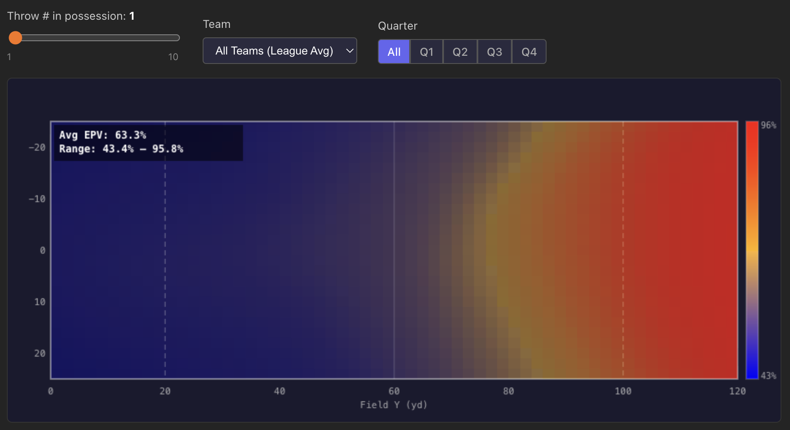</td>
      <td>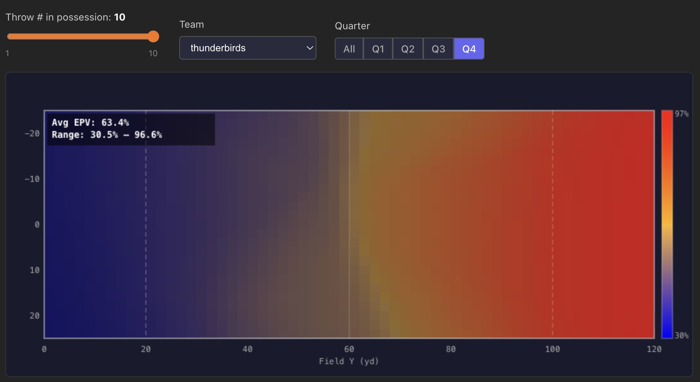</td>
    </tr>
    <tr>
      <td align="center"><em>League-wide</em></td>
      <td align="center"><em>Team-filtered</em></td>
    </tr>
  </table>
</div>

---

## Turnover & Block Heatmaps

Normalizing flow models predict spatial turnover and block probability across the field. A separate heatmap shows where turnovers originate historically, with team and opponent filters.

<div align="center">
  <table>
    <tr>
      <td>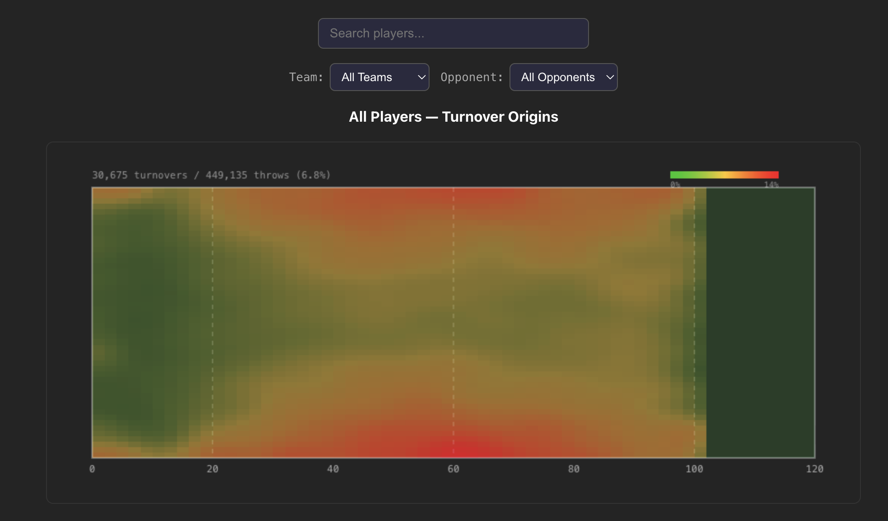</td>
      <td>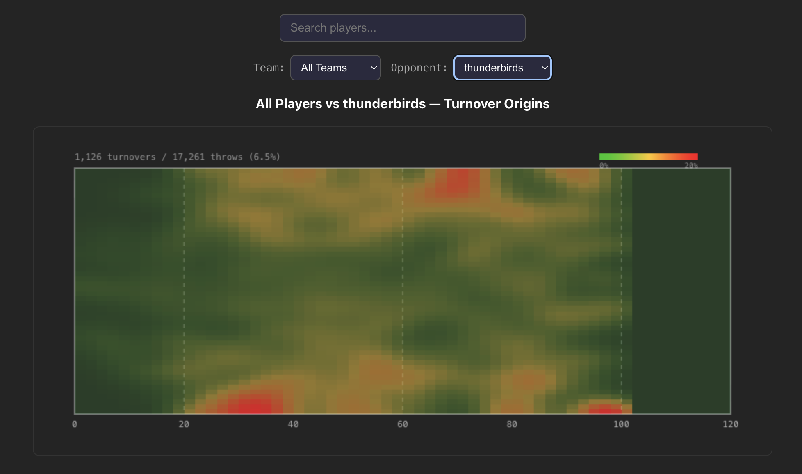</td>
    </tr>
    <tr>
      <td align="center"><em>League-wide</em></td>
      <td align="center"><em>Team-filtered</em></td>
    </tr>
  </table>
</div>

---

## Player Embeddings

Players are embedded using a learned representation and projected into 2D via UMAP, then clustered with k-means. Hover over any player to see their stats and cluster archetype — surfacing stylistic similarities across the league.

<div align="center">
  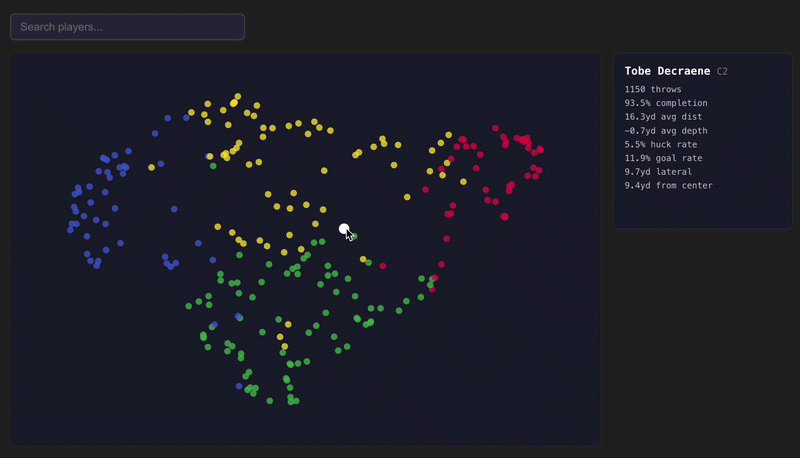
</div>

---

## Team Pages

Team pages show season record, O-line hold rate, top players by hold rate, top pair synergies, and a full game history grouped by year — all filterable by season.

<div align="center">
  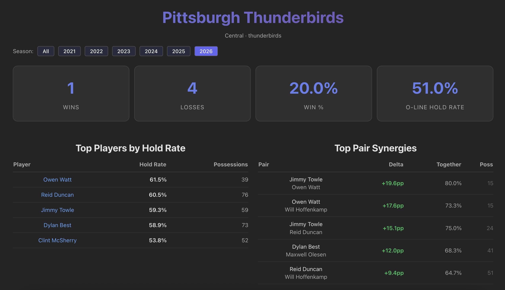
</div>
<div align="center">
  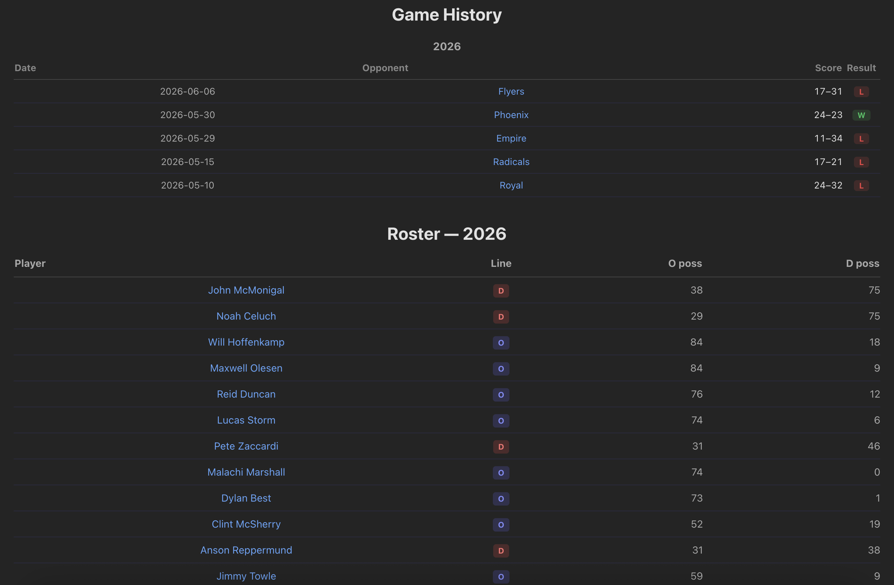
</div>

---

## ML Models

| Model | Task | Architecture |
|-------|------|-------------|
| **Throw Flow** | Predict throw destination probability by field position + player | Conditional Normalizing Flow |
| **Turnover Flow** | Predict turnover probability by throw origin | Normalizing Flow |
| **Block Flow** | Predict block probability by throw origin | Normalizing Flow |
| **EPV** | Expected possession value by field position | Neural Network (PyTorch) |
| **Lineup Scorer** | Predict O-line scoring probability for any 7-player lineup | LightGBM · AUC 0.6513 |
| **Pull Play CVAE** | Generate likely play sequences from a pull landing position | Conditional VAE (PyTorch) |
| **Completion %** | Predict throw completion probability | XGBoost |
| **Player Embeddings** | Learn player representations for similarity and clustering | Embedding layer + UMAP + k-means |

The lineup model uses 99 features per lineup including per-player throwing and receiving stats, pair familiarity across all 21 player pairs in a 7-person line, and game context (score differential, quarter).

---

## Engineering Highlights

**Data pipeline** — Custom Python ingestion pipeline pulls from the UFA public API, normalizes coordinates into a unified field frame, and populates a PostgreSQL schema with ~560K events and ~460K line player records across 762 games.

**Precomputed heatmap caches** — Heatmap grids are precomputed at ingestion time and stored as float16 binary in the database. The backend serves them as base64-encoded batch responses, reducing per-page HTTP requests from ~480 to 1 and cutting payload size ~10× versus JSON float arrays.

**Blocker identification via event zipping** — The UFA play-by-play records throwaways and blocks as separate sequential events. To attribute a block to the correct defender, the pipeline zips forward through adjacent events after each throwaway, matching it to the first block event (event type 11) from the opposing team within a small window — skipping injury stoppages. This same technique is used to classify block types (huck, short, reset) by joining the block event back to the preceding throw.

**Performance** — GZip middleware on the FastAPI backend, lazy float16 decode on the frontend (grids decoded on demand with a Map cache), and Railway scale-to-zero keep costs under $20/month at 425MB steady-state memory.

---

## Tech Stack

| Layer | Technologies |
|-------|-------------|
| **Frontend** | React, TypeScript, Vite |
| **Backend** | FastAPI, Python |
| **Database** | PostgreSQL |
| **ML** | PyTorch, LightGBM, XGBoost, scikit-learn, UMAP, scipy |
| **Deployment** | Railway (backend + DB), Vercel (frontend) |
| **Data** | UFA public API → custom ingestion pipeline |

---

## Architecture

```
UFA Public API
      ↓
Python ingestion pipeline (762 games, ~560K events)
      ↓
PostgreSQL — events, games, players, line_players, precomputed cache tables
      ↓
FastAPI backend — REST API + batch heatmap endpoints + ML inference
      ↓
React / TypeScript frontend — ultimate-analytics.com
```

---

## Author

**Joe Molder** · [GitHub](https://github.com/JoeMolder) · [ultimate-analytics.com](https://www.ultimate-analytics.com/)
